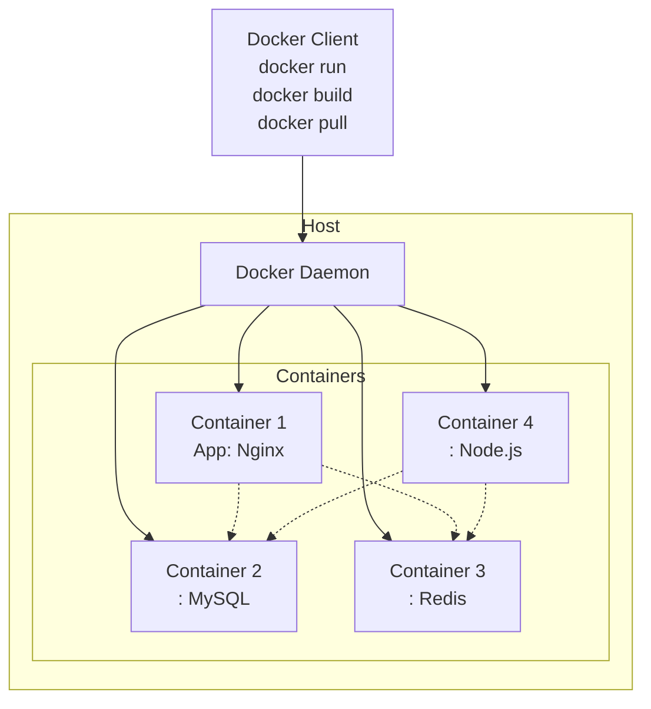

---
tags:
  - Notes
links: "[[OD Lecture 1]]"
creation date: 2024-11-09 14:56
modification date: Saturday 9th November 2024 14:56:37
semester: 3
year: 2024
---

---
# OD Lecture 1 Notes

---

## Docker and Containerization

- Docker is defined as a container runtime responsible for managing the lifecycle of containers.
- A Dockerfile creates a Docker Image, consisting of a read-only template built layer by layer.
- Example Dockerfile commands show the process of initializing an image and specifying configuration options.
- Docker containers are isolated, run instances created from images, and can be run via the Docker CLI commands.

##  Container Registry and Architecture

- The Docker Registry functions similarly to GitHub but for Docker Images, with Docker Hub being the default public registry.
- The architecture of Docker Compose allows for the configuration of multi-container applications, clarifying methods for exposing ports and managing services.

# Containers in Production

- Deployment considerations in a production environment highlight isolation, portability, maintainability, and deplorability advantages.
- Strategies for addressing application or host failures within single and multi-machine setups are discussed, emphasizing resource management and recovery needs.
- Key challenges include ensuring scalability, availability, reliability, recoverability, and robustness in deploying containers.

# Container Orchestration

- Container orchestration systems manage configurations, coordination, and the lifecycle of containers across clusters.
- The orchestrator plays a critical role in operating within a container runtime infrastructure, ensuring efficient resource utilization and application performance.
- Emphasis is placed on the ability to efficiently manage multiple containers to maintain service levels despite varying workloads.

# Infrastructure and Virtualization

- Examples demonstrate various server infrastructures under different conditions (Type 1 and Type 2 Hypervisors) and the implementation of virtual machines.
	- A hypervisor is a software layer that enables the creation and management of virtual machines (VMs) on a physical host machine. It acts as an intermediary between the hardware and the operating systems running on the VMs, allowing multiple operating systems to run concurrently on a single physical machine.
	- **Type 1 Hypervisor (Bare-metal)**: This type runs directly on the host's hardware without an underlying operating system. It is typically more efficient and offers better performance as it has direct access to the hardware resources. Examples include VMware ESXi and Microsoft Hyper-V.
	- **Type 2 Hypervisor (Hosted)**: This type runs on top of a conventional operating system. It relies on the host OS for resource management and may have slightly lower performance compared to Type 1 hypervisors. Examples include VMware Workstation and Oracle VirtualBox.
- Advantages of virtualization include host protection and suspension capabilities of running VMs, while disadvantages encompass resource sharing and startup speeds.
## Virtual machine architecture 

![[Pasted image 20241006135754.png]]