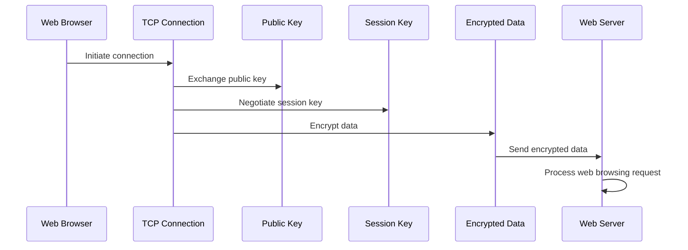

---
tags:
  - Notes
links: "[[web-tech Lecture 10]]"
creation date: 2024-11-19 19:29
modification date: Tuesday 19th November 2024 19:29:33
semester: 3
year: 2024
---

---
# [[web-tech Lecture 10 Notes]]

---

## HTTPS Overview

- HTTPS stands for HyperText Transfer Protocol Secure, serving as the primary protocol for secure data transmission between web browsers and websites.
- It enhances the standard HTTP protocol by incorporating SSL (Secure Socket Layer) and TLS (Transport Layer Security) for establishing encrypted communication.
- The encryption used in HTTPS protects sensitive data, such as passwords and personal information, during transmission, preventing interception by unauthorized parties.
- HTTPS uses public key infrastructure for securing connections, involving both public and private keys, to encrypt and decrypt data safely.
- The main advantages of HTTPS include improved security, trustworthiness for users, and compliance with data protection regulations.

## Differences Between HTTP and HTTPS

- HTTP is the traditional protocol for transferring data on the web, whereas HTTPS is the secure version that encrypts the data during transfer.
- URLs for HTTP start with "http://" while URLs for HTTPS begin with "https://."
- HTTP operates at the application layer, while HTTPS operates at the transport layer.
- HTTP is generally faster in transmission speed when compared to HTTPS due to the overhead of encryption.
- HTTPS offers a higher level of security, guarding against data interception and alteration.

## SSL and Its Role in HTTPS

- SSL is the standard technology for establishing a secure connection by encrypting data exchanged between browser and web server.
- SSL certificates are used to authenticate the server's identity, ensuring that communication is occurring with the intended server and that data remains confidential.
- Two key roles of the SSL layer include ensuring direct communication between the browser and the required server, and maintaining privacy by restricting access to exchanged messages to only those communicating systems.
- The SSL connection facilitates the encryption and decryption of data, ensuring data integrity throughout its transmission.
- By utilizing both SSL and HTTPS, websites significantly mitigate risks of data breaches caused by eavesdropping or man-in-the-middle attacks.